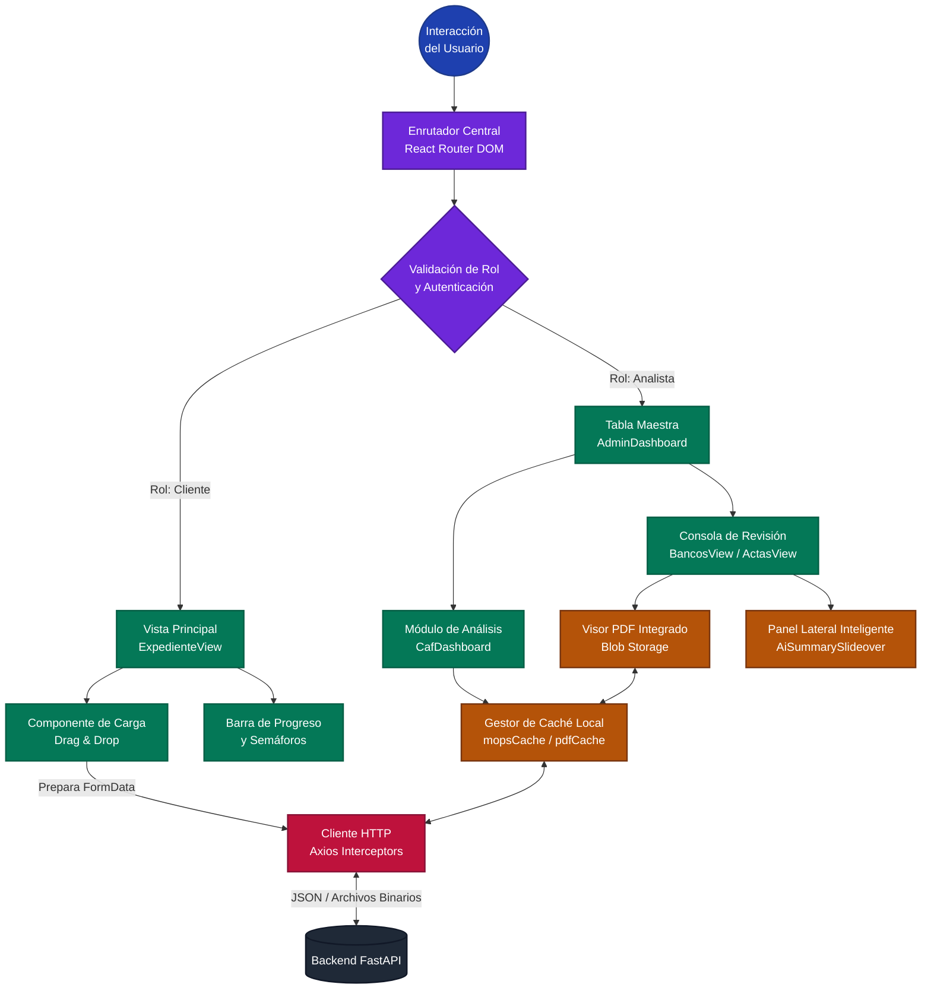

### Arquitectura y Flujo de Procesos del Frontend

Para comprender la estructura de la interfaz de usuario en su totalidad, es necesario analizar el flujo de trabajo desde la inicialización de la aplicación hasta la interacción con los módulos más complejos. El frontend de AutoTeaser fue diseñado siguiendo el patrón de Aplicación de Página Única (SPA, por sus siglas en inglés) mediante React.js. Esta decisión arquitectónica permite que el navegador cargue un único documento HTML y que el contenido principal se actualice dinámicamente mediante JavaScript, eliminando los tiempos muertos provocados por la recarga tradicional de páginas.

Para ilustrar de manera exhaustiva esta arquitectura, se diseñó el siguiente diagrama de flujo estructurado por capas lógicas:

*Figura 16. Diagrama de flujo detallado de la arquitectura de componentes y manejo de estado en el Frontend. Elaboración Propia (2026).*

#### 1. Capa de Enrutamiento y Control de Acceso
El ciclo de vida del Frontend inicia en el componente raíz (`App.jsx`), donde la librería `react-router-dom` toma el control de la barra de direcciones del navegador. Al detectar una petición, el sistema atraviesa un middleware lógico que verifica el rol del usuario actual. Si el usuario es una empresa o individuo solicitante de crédito, el enrutador bloquea el acceso a las herramientas de análisis interno y lo redirige exclusivamente al **Portal del Cliente**. Por el contrario, los miembros internos de la institución son dirigidos al **Portal Administrativo**. Este aislamiento lógico desde la capa de enrutamiento garantiza la seguridad de la información confidencial de los expedientes.

#### 2. Portal del Cliente: Carga Guiada y Estado en Tiempo Real
Una vez dentro del Portal del Cliente, la interfaz (`ExpedienteView`) se construye a partir de la filosofía de "Reducción de Fricción". En lugar de presentar formularios complejos, la pantalla se organiza dinámicamente utilizando contenedores tipo acordeón que categorizan los requisitos en tres grandes ramas: *Legal*, *Fiscal* y *Bancario*.

El flujo operativo del cliente se detalla de la siguiente manera:
1. **Evaluación de Progreso:** Al montar el componente, se dispara un *Hook* de React (`useEffect`) que consulta al servidor el estado actual de los documentos de ese cliente específico. Con esta información, el Frontend pinta un indicador visual (ej. "Expediente al 75%").
2. **Sistema de Semáforos Visuales:** Cada documento listado es renderizado dinámicamente con un indicador de estado. Si el documento fue subido y aprobado, se muestra en verde; si está pendiente de revisión por el banco, en amarillo; y si fue rechazado por estar ilegible o vencido, en rojo (acompañado de una alerta interactiva con la retroalimentación del analista).
3. **Mecanismo de Subida (Drag & Drop):** Cuando el cliente arrastra un archivo PDF (por ejemplo, una Constancia de Situación Fiscal), el componente intercepta el archivo físico, lo empaqueta en una estructura de datos `FormData` nativa del navegador y delega el proceso a la capa de red para su envío asíncrono. Esto evita el refresco de la página y permite subir múltiples documentos simultáneamente.

#### 3. Portal Administrativo: Consola de Análisis y Manejo de Estado (Caché)
El Portal Administrativo es el núcleo analítico de la plataforma. El flujo inicial carga una Tabla Maestra (`AdminDashboard`) que resume la actividad de todos los clientes de la institución. Al hacer clic sobre un expediente, el analista ingresa a una consola de trabajo de doble panel (Split View).

El funcionamiento interno de este portal es altamente complejo y se basa en los siguientes procesos:
* **Manejo Dinámico de PDF (Blob Storage):** Para evitar que el analista deba descargar cada archivo a su computadora local, el Frontend solicita al servidor los documentos PDF y los procesa en la memoria del navegador. Utilizando un Visor PDF Integrado, el documento se renderiza en un panel izquierdo (ej. `ActasView` o `BancosView`), permitiendo al analista hacer zoom o desplazarse por el documento original de manera fluida.
* **Paneles Laterales Inteligentes (Slideovers):** En el panel derecho de la interfaz, componentes interactivos como `AiSummarySlideover` muestran los datos que la Inteligencia Artificial extrajo del documento. El analista tiene botones de "Aprobar" o "Rechazar", lo que permite comparar visualmente el documento original contra la extracción lógica en la misma pantalla.
* **Gestión de Memoria y Caché Persistente:** Dado que el analista navega rápidamente entre múltiples pestañas y expedientes, el Frontend implementa diccionarios de caché locales (ej. `mopsCache` y `pdfCache`). Si el analista regresa a un documento previamente abierto, la interfaz recupera los datos inmediatamente de la RAM del navegador en lugar de volver a descargarlos del servidor. Esta estrategia reduce drásticamente el consumo de ancho de banda y la latencia, ofreciendo una experiencia instantánea.

#### 4. Frontend del Módulo AutoCAF: Carga, Recortes y Previsualización
Dentro del Portal Administrativo, se implementó un componente dedicado exclusivamente a la generación de los Consolidados de Análisis Financiero (`CafDashboard.jsx`). Este módulo requirió una interfaz de usuario avanzada para gestionar archivos multicapas y flujos de trabajo asíncronos.

El proceso interactivo del AutoCAF en el frontend se divide en cuatro etapas críticas:
1. **Dropzone Multidocumento:** El analista arrastra varios PDFs correspondientes a diferentes ejercicios fiscales hacia una zona interactiva (Dropzone). El componente empaqueta los archivos mediante `FormData` y los envía al servidor, cambiando dinámicamente el estado visual de cada archivo a "Cargado" (`uploaded`).
2. **Selección Visual de Páginas y Recortes (Region Selector):** Una vez cargados los PDFs, el frontend despliega miniaturas dinámicas (Thumbnails) de cada página. Debido a que los estados financieros pueden tener decenas de páginas de notas irrelevantes, el analista puede hacer clic sobre las miniaturas para seleccionar únicamente las páginas que contienen el Balance General y el Estado de Resultados. Además, se desarrolló una herramienta interactiva de "Recortes" (Region Selector) que permite al usuario trazar cajas delimitadoras (*Bounding Boxes*) sobre la imagen del documento, forzando al motor de OCR a procesar exclusivamente esa área y descartar encabezados o tablas innecesarias.
3. **Procesamiento y Estado Interactivo:** Al hacer clic en "Analizar", el estado de los documentos cambia a `processing`, desplegando indicadores de carga (*spinners*) para informar al usuario que la Inteligencia Artificial está trabajando en segundo plano. Cuando el servidor responde, el estado cambia a `processed` y se habilita la previsualización de los datos.
4. **Previsualización de Datos y Exportación Binaria:** El frontend despliega una tabla u hoja lateral con el JSON extraído, permitiendo al analista auditar las cifras obtenidas (ej. total de Activos, Pasivos y Capital). Finalmente, el usuario puede presionar el botón de exportación, mediante el cual Axios realiza una petición para recibir el archivo binario del Excel ensamblado, forzando al navegador a lanzar una ventana nativa de descarga del archivo `.xlsx`.

#### 5. Capa de Red y Sincronización (Axios)
Toda la orquestación entre la interfaz visual y la lógica del servidor (FastAPI) ocurre a través de una instancia configurada de `Axios`. Esta capa de red está estructurada en un archivo centralizado (`api.js`) y cumple tres propósitos vitales:
1. **Peticiones HTTP Estandarizadas:** Gestiona todos los métodos REST empaquetando los encabezados necesarios, incluyendo orígenes permitidos (CORS).
2. **Manejo Centralizado de Errores (Interceptors):** Si durante una operación ocurre un error (por ejemplo, si el servidor devuelve un error HTTP 404 porque un archivo PDF estaba corrupto), el interceptor lo captura antes de que alcance el componente visual. Dependiendo de la severidad, despliega alertas informativas controladas ("Toasts" UI) sin colapsar la aplicación.
3. **Conversión de Formatos:** Interviene en la recepción de archivos complejos binarios, traduciendo las respuestas crudas del servidor en archivos Excel o PDF descargables automáticamente por el navegador.

En conclusión, la arquitectura del Frontend fue concebida no solo como una capa estética, sino como una máquina de estados compleja. Mediante la correcta distribución de responsabilidades —enrutamiento, componentes modulares interactivos como el Selector de Regiones, manejo avanzado de memoria y una capa de red robusta— AutoTeaser proporciona a ambos actores (cliente y analista) flujos de trabajo especializados que operan bajo los más altos estándares de rendimiento de las aplicaciones web modernas.
